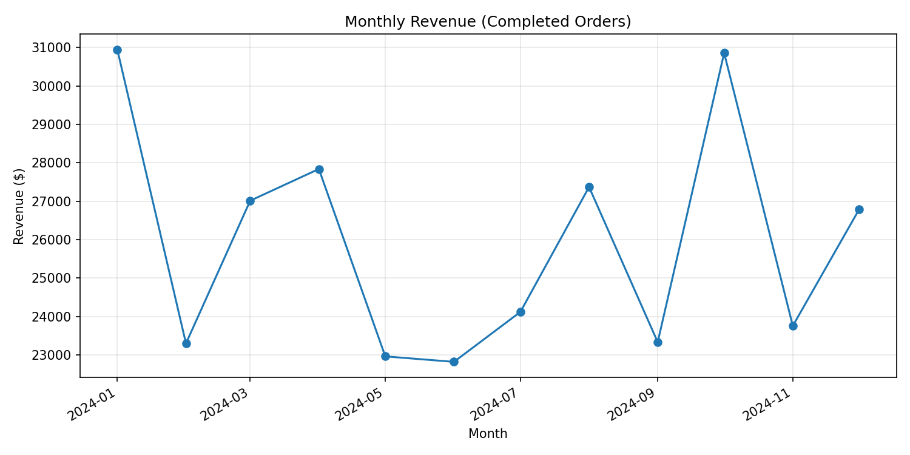
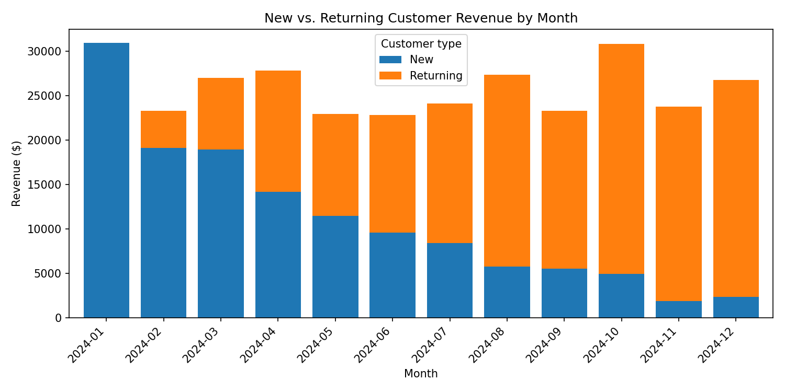

# E-Commerce Customer & Revenue Analytics

An end-to-end analytics project on a synthetic e-commerce dataset (customers,
orders, order line items, products), built to demonstrate SQL, Python/pandas,
data cleaning, exploratory analysis, KPI design, cohort analysis, RFM
customer segmentation, and BI dashboard readiness.

## Business objective

> **What is driving revenue performance, which customers and products are
> most valuable, and where should the company focus to improve customer
> retention and revenue growth?**

The analysis is organized around five questions:

1. **Revenue trends** — monthly revenue, MoM growth, order volume, average
   order value, revenue by product/category/region
2. **Customer behavior** — new vs. returning customers, repeat purchase
   rate, purchase frequency, customer lifetime revenue, customer
   concentration
3. **RFM segmentation** — Recency / Frequency / Monetary scoring into
   segments (Champions, Loyal, Potential Loyalists, At Risk, Lost)
4. **Cohort retention** — acquisition-month cohorts and a retention matrix
5. **Product performance** — top products/categories by revenue and volume,
   revenue contribution, concentration

Findings are written up as explicit **observations vs. recommendations** in
`reports/findings.md` (added once the analysis notebooks are complete).

## Key findings so far

From `notebooks/02_exploratory_data_analysis.ipynb` (full detail in that notebook's Section 9):

<p>
  
  
</p>

- **Total revenue is flat for 2024** (~$23K–$31K/month, +0.2% average MoM growth) — no sustained growth or decline.
- **That flat total is hiding a real problem:** new-customer revenue falls almost every month, from $30,948 in January to ~$2,000 by November/December, while returning-customer revenue grows to compensate. Flat revenue is currently being propped up by the existing customer base, not new acquisition.
- **Repeat purchase behavior is strong** — 73.4% of customers placed 2+ completed orders (avg. 2.60 orders/customer) — so the retention side isn't the issue; the acquisition funnel is the more likely place to investigate.
- Revenue is well balanced across product categories (Hair 32.7% down to Skin 16.8%) and countries (Italy 22.7% down to Germany 15.9%) — no single category or market the business is overexposed to.

## Project status

This repo is being built in phases. Current state:

- [x] Project scaffolding, `.gitignore`, `requirements.txt`
- [x] Data profiling, validation, and cleaning (`notebooks/01`)
- [x] SQL schema, load scripts, and a `fact_sales` view (`sql/01`–`03`)
- [x] Revenue trend EDA (`notebooks/02`)
- [ ] RFM segmentation (`notebooks/03`, `sql/05`)
- [ ] Cohort retention (`notebooks/04`, `sql/06`)
- [ ] Product performance (`notebooks/05`, `sql/07`)
- [ ] Business recommendations write-up (`reports/findings.md`)
- [ ] Power BI dashboard (`dashboard/`)

## Tech stack

Python (pandas, matplotlib) in Jupyter · PostgreSQL-compatible SQL · Power BI
· Git/GitHub. No machine learning — this project is scoped to demonstrate
analytics and business reasoning, not predictive modeling.

## Repository structure

```
data/
  raw/                     original source CSVs (not modified)
  processed/               cleaned tables written by notebooks/01, read by
                            everything downstream (SQL loads, later
                            notebooks, Power BI)
notebooks/
  01_data_cleaning_validation.ipynb   profiling, validation, cleaning rules,
                                       builds fact_sales / fact_sales_completed
  02_exploratory_data_analysis.ipynb  revenue trend, MoM growth, order volume,
                                       AOV, category/region mix, new vs returning
  03-05 ...                           RFM, cohort, product performance (planned)
sql/
  01_schema.sql            table definitions + constraints
  02_load_data.sql         \copy load script + row-count sanity check
  03_fact_sales.sql        fact_sales / fact_sales_completed views
  04-07 ...                analysis queries (planned, one per notebook)
reports/
  figures/                 exported chart images
  findings.md              observations vs. recommendations (planned)
dashboard/
  README.md                Power BI data model + measures (planned)
```

## Source data

**Dataset:** [E-Commerce Sales & Customer Analytics Dataset](https://www.kaggle.com/datasets/maramsa/e-commerce-sales-and-customer-analytics-dataset) by [maramsa](https://www.kaggle.com/maramsa) on Kaggle, licensed under [Apache License 2.0](https://www.apache.org/licenses/LICENSE-2.0).

Downloaded from Kaggle and used unmodified in `data/raw/`. Product names in the source data are
placeholders (`Product_1`, `Product_2`, ...), which suggests this is a
synthetically generated dataset rather than real transaction records — that
doesn't affect its usefulness for demonstrating the analytics workflow here,
but it's worth knowing findings describe the dataset's patterns, not an
actual company's.

Provided as five CSVs under `data/raw/`:

| File | Grain | Key columns |
|---|---|---|
| `customers.csv` | 1 row / customer (300 rows) | `customer_id`, `country`, `signup_date` |
| `products.csv` | 1 row / product (50 rows) | `product_id`, `product_name`, `category` |
| `orders.csv` | 1 row / order (1,000 rows) | `order_id`, `customer_id`, `order_date`, `status` |
| `order_items.csv` | 1 row / order line (2,000 rows) | `order_id`, `product_id`, `quantity`, `price` |
| `sales_cleaned.csv` | pre-joined reference extract | used only as an external sanity check in `notebooks/01`, not as a pipeline input |

`status` ∈ `{Completed, Cancelled, Returned}`. Revenue analysis throughout
this project uses **Completed orders only**; Cancelled/Returned are tracked
separately as operational metrics. See `notebooks/01`, Section 8, for the
full rationale.

### Data quality findings (from `notebooks/01`)

- 139 of 1,000 orders (13.9%) have no matching line items — excluded from the
  line-level fact table, called out explicitly rather than silently dropped.
- 33 duplicate `(order_id, product_id)` pairs in `order_items` — kept as
  separate legitimate lines (no exact duplicate rows found).
- 55 orders have an `order_date` earlier than the customer's `signup_date` —
  flagged as a data anomaly to keep in mind, not corrected (no reliable way
  to infer the "true" date from the data available).
- No orphaned foreign keys, no null key fields, no duplicate primary keys in
  any of the four raw tables.
- The rebuilt `fact_sales_completed` table matches `sales_cleaned.csv`
  exactly: 1,625 line items, 695 distinct orders, $311,111 total revenue.

## Reproducing this project

```bash
python3 -m venv .venv && source .venv/bin/activate
pip install -r requirements.txt

# 1. Clean & validate the raw data, build fact_sales
jupyter nbconvert --to notebook --execute --inplace notebooks/01_data_cleaning_validation.ipynb

# 2. (optional) load the same data into PostgreSQL
createdb ecommerce_analytics
psql -d ecommerce_analytics -f sql/01_schema.sql
psql -d ecommerce_analytics -f sql/02_load_data.sql
psql -d ecommerce_analytics -f sql/03_fact_sales.sql
```

See `sql/README.md` for SQL-specific notes (including running against DuckDB
if you don't have a local Postgres server).

## License

The code in this repository (notebooks, SQL, docs) is licensed under the
[MIT License](LICENSE). The dataset in `data/raw/` is separately licensed by
its original author under Apache 2.0 — see [Source data](#source-data) above.

## Author

Yvonne
