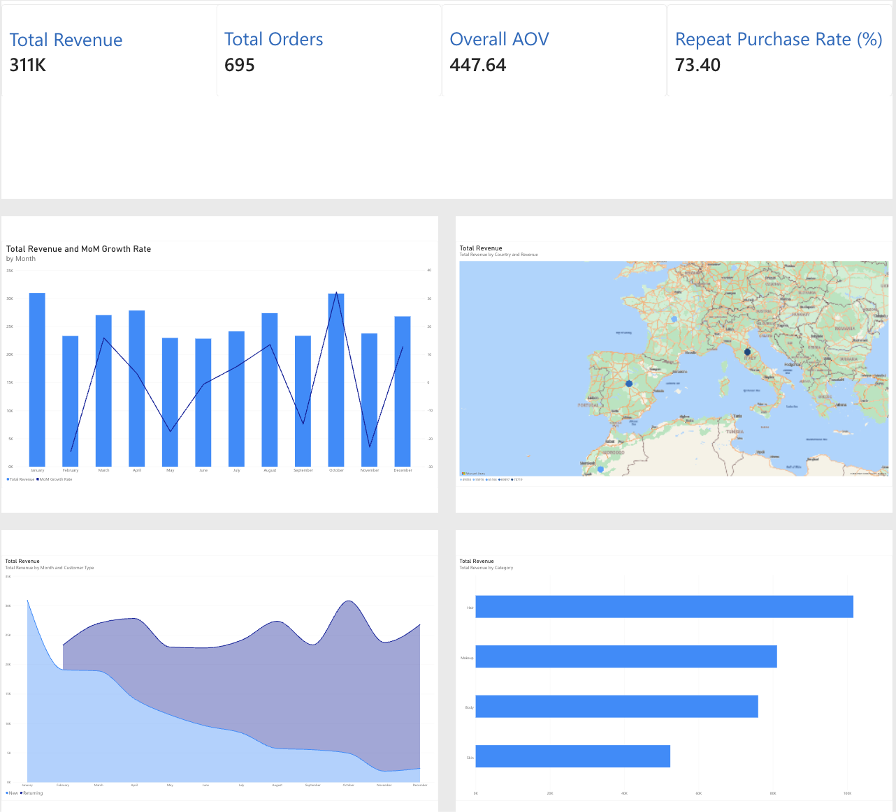

# Power BI — Revenue Overview

Built in **Power BI Service** (browser), on the pre-aggregated tables exported by [`sql/04_revenue_trends.sql`](../sql/04_revenue_trends.sql) and packaged in [`data/revenue_overview.xlsx`](data/revenue_overview.xlsx).

## What's on the page

**KPI cards** (from `headline_kpis`): Total Revenue ($311K), Total Orders (695), Overall AOV ($447.64), Repeat Purchase Rate (73.40%).

**Total Revenue and MoM Growth Rate by Month** (from `monthly_kpis`) — combo chart: bars for monthly revenue, line for month-over-month growth %. Shows the pattern from `notebooks/02`: revenue bounces between ~$23K–$31K with no sustained trend (Oct's spike and Feb/Nov's dips stand out).

**Total Revenue by Country** (from `country_revenue`) — map visual, bubble size scaled to revenue. All 5 countries are in the data and on the map; France and Germany's bubbles are just small relative to Spain/Italy given how close the 5 countries' revenue shares are (15.9%–22.7%), which is expected behavior for this visual type rather than a data issue.

**Total Revenue by Month and Customer Type** (from `new_vs_returning`) — stacked area chart. This is the headline finding from `notebooks/02`: the "New" band (light blue) shrinks steadily through the year while "Returning" (purple) grows to compensate — flat total revenue, but increasingly dependent on repeat customers rather than new acquisition.

**Total Revenue by Category** (from `category_revenue`) — horizontal bar chart, Hair leading down to Skin, consistent with the 32.7%/26.1%/24.4%/16.8% split found in the notebook.

## Data source

| Table | Rows | Built by |
|---|---|---|
| `headline_kpis` | 1 | `sql/04_revenue_trends.sql` |
| `monthly_kpis` | 12 | `sql/04_revenue_trends.sql` |
| `country_revenue` | 5 | `sql/04_revenue_trends.sql` |
| `new_vs_returning` | 23 | `sql/04_revenue_trends.sql` |
| `category_revenue` | 4 | `sql/04_revenue_trends.sql` |

All five were verified against `notebooks/02_exploratory_data_analysis.ipynb`'s output before upload — see `sql/04_revenue_trends.sql`'s header comment. To refresh the dashboard after the underlying data changes: re-run `sql/01`–`04`, rebuild `data/revenue_overview.xlsx`, and re-upload it in Power BI Service (the existing dataset can be replaced in place via **Datasets → (...) → Refresh** or by re-uploading the file).
