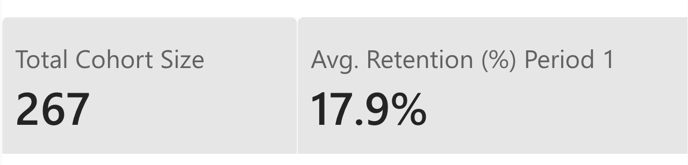

# Power BI Dashboard

Built in **Power BI Service** (browser). Each page below is documented once it's actually built, with the data source it reads from and any issues found while verifying it against the notebooks.

## Page 1: Revenue Overview

Built on the pre-aggregated tables exported by [`sql/04_revenue_trends.sql`](../sql/04_revenue_trends.sql) and packaged in [`data/revenue_overview.xlsx`](data/revenue_overview.xlsx).


**KPI cards** (from `headline_kpis`): Total Revenue ($311K), Total Orders (695), Overall AOV ($447.64), Repeat Purchase Rate (73.40%).

**Total Revenue and MoM Growth Rate by Month** (from `monthly_kpis`) — combo chart: bars for monthly revenue, line for month-over-month growth %. Shows the pattern from `notebooks/02`: revenue bounces between ~$23K–$31K with no sustained trend (Oct's spike and Feb/Nov's dips stand out).

**Total Revenue by Country** (from `country_revenue`) — map visual, bubble size scaled to revenue. All 5 countries are in the data and on the map; France and Germany's bubbles are just small relative to Spain/Italy given how close the 5 countries' revenue shares are (15.9%–22.7%), which is expected behavior for this visual type rather than a data issue.

**Total Revenue by Month and Customer Type** (from `new_vs_returning`) — stacked area chart. This is the headline finding from `notebooks/02`: the "New" band (light blue) shrinks steadily through the year while "Returning" (purple) grows to compensate — flat total revenue, but increasingly dependent on repeat customers rather than new acquisition.

**Total Revenue by Category** (from `category_revenue`) — horizontal bar chart, Hair leading down to Skin, consistent with the 32.7%/26.1%/24.4%/16.8% split found in the notebook.

**Data source:**

| Table | Rows | Built by |
|---|---|---|
| `headline_kpis` | 1 | `sql/04_revenue_trends.sql` |
| `monthly_kpis` | 12 | `sql/04_revenue_trends.sql` |
| `country_revenue` | 5 | `sql/04_revenue_trends.sql` |
| `new_vs_returning` | 23 | `sql/04_revenue_trends.sql` |
| `category_revenue` | 4 | `sql/04_revenue_trends.sql` |

All five were verified against `notebooks/02_exploratory_data_analysis.ipynb`'s output before upload — see `sql/04_revenue_trends.sql`'s header comment.

## Page 2: RFM Analysis

Built on `customer_rfm` (267 rows, one per customer) and `rfm_segment_summary` (5 rows, one per segment), both exported by [`sql/05_rfm_segmentation.sql`](../sql/05_rfm_segmentation.sql) and packaged in [`data/rfm_segments.xlsx`](data/rfm_segments.xlsx).


**Customers Segmentation** and **Revenue % Segmentation** (top-left, bar charts) — segment size and revenue share, matching `notebooks/03`: Loyal (81 customers, 42.9% of revenue) and Potential Loyalists (69, 16.7%) are the two largest segments by count; Champions (9, 8.2%) is the smallest but highest-value per customer.

**KPI cards** (bottom-left): Total Customers (267), Total Revenue ($311,111), Avg Revenue/Customer ($1,165.21), Avg Recency Days (118.55) — the latter two are DAX measures (`AVERAGE(customer_rfm[monetary])` / `AVERAGE(customer_rfm[recency])`) rather than plain fields, so they stay correct under the segment slicer next to them.

**Recency (days) and Monetary ($) by segment** (top-right, scatter) — one bubble per segment, showing the same shape as `notebooks/03`'s segment table: At Risk and Lost sit far right (high recency = long since their last order) despite At Risk's monetary value being much closer to Loyal's than Lost's — visually, the segment that most needs attention.

**Segment Overview** (table) — per-segment customer count, average recency, average frequency, and total revenue. Every cell matches `notebooks/03`'s `rfm_segment_summary` exactly.

**Data source:**

| Table | Rows | Built by |
|---|---|---|
| `customer_rfm` | 267 | `sql/05_rfm_segmentation.sql` |
| `rfm_segment_summary` | 5 | `sql/05_rfm_segmentation.sql` |

### Data quality issues found and fixed while building this page

Two real bugs turned up during verification against `notebooks/03`'s numbers — worth documenting since they're common, easy-to-miss Power BI mistakes:

1. **Wrong aggregation type (Sum instead of Count/Average).** The Segment Overview table and the scatter plot were originally built by dragging raw fields from the 267-row `customer_rfm` sheet straight into the visuals. Power BI defaults every numeric field to **Sum** — so "Number of Customers" was showing `SUM(customer_id)` (a meaningless sum of ID numbers, e.g. 5,253 for At Risk instead of the real count of 31), and "Recency"/"Frequency" were showing summed totals instead of averages (e.g. 5,532 instead of the true average of 178.5 days). Only "Monetary" was correct, since a segment's *total* revenue genuinely is a sum. **Fix:** rebuilt the table and scatter plot from the pre-aggregated `rfm_segment_summary` sheet instead, which already has the correct `customers`, `avg_recency_days`, `avg_frequency`, and `total_revenue` columns — no manual aggregation-type fixes needed.
2. **"Average of averages" on the two KPI cards.** Avg. Revenue/Customer and Avg. Recency Days were originally built from `rfm_segment_summary` too, using Power BI's default **Average** aggregation on that sheet's already-averaged columns — which averages the 5 *segment* averages against each other, unweighted by segment size, rather than averaging across all 267 customers. This produced impossible values (533.30 average recency days, when the maximum possible value in the whole dataset is 365). **Fix:** two DAX measures on the 267-row `customer_rfm` table instead:
   ```dax
   Avg Revenue per Customer = AVERAGE(customer_rfm[monetary])
   Avg Recency Days = AVERAGE(customer_rfm[recency])
   ```
   These correctly average over every customer row, and — as a bonus — respond correctly to the segment slicer on the page (selecting "At Risk" recalculates to that segment's true average, rather than needing a separate lookup).

A similar `Revenue %` measure (`DIVIDE(SUM(customer_rfm[monetary]), CALCULATE(SUM(customer_rfm[monetary]), ALL(customer_rfm)))`) was written for the Revenue % Segmentation chart, so each bar divides by the true grand total rather than being filtered by its own segment.

## Page 3: Cohort Retention

Built on `cohort_retention_long` (77 rows, one per cohort × months-since-acquisition) and `cohort_sizes` (12 rows, one per cohort month), both exported by [`sql/06_cohort_retention.sql`](../sql/06_cohort_retention.sql) and packaged in [`data/cohort_retention.xlsx`](data/cohort_retention.xlsx).




**KPI cards:** Total Cohort Size (267), Avg. Retention (%) Period 1 (17.9%). Period 1 — the first full month after a customer's first purchase — is used rather than a later period because it's the only period nearly every cohort (11 of 12) has actually had a chance to reach yet, given the data only runs through December 2024; it's also the exact metric `notebooks/04` used to test (and rule out) declining retention quality across cohorts.

**Cohort Size by Month** (bar chart, from `cohort_sizes`) — this is the headline chart on the page: 61 new customers in January falling steadily to 4 in December. This is the real cause behind `notebooks/02`'s declining new-customer-revenue finding — fewer new customers being acquired each month, not a retention problem. A **Cohort Month slicer** sits above this chart, letting a viewer filter both it and the matrix down to a single cohort.

**Retention Matrix** (from `cohort_retention_long`, pivoted as a Power BI Matrix with `cohort_month` on rows and `period_number` on columns) — the same triangular retention heatmap as `notebooks/04`, with conditional-formatting background color standing in for the notebook's `imshow` heatmap. Every cell checked against the notebook's saved output matches exactly (e.g. January: 100, 11.5, 26.2, 18.0, 18.0, 14.8, 9.8, 29.5, 18.0, 19.7, 23.0, 11.5).

**Data source:**

| Table | Rows | Built by |
|---|---|---|
| `cohort_retention_long` | 77 | `sql/06_cohort_retention.sql` |
| `cohort_sizes` | 12 | `sql/06_cohort_retention.sql` |

Both verified against `notebooks/04_cohort_retention.ipynb`'s output — see `sql/06_cohort_retention.sql`'s header comment. No aggregation-type bugs this time (unlike Page 2): `cohort_sizes` is already exactly one row per cohort month, so there's no raw per-row table being summed/averaged incorrectly the way `customer_rfm` was on the RFM page.
